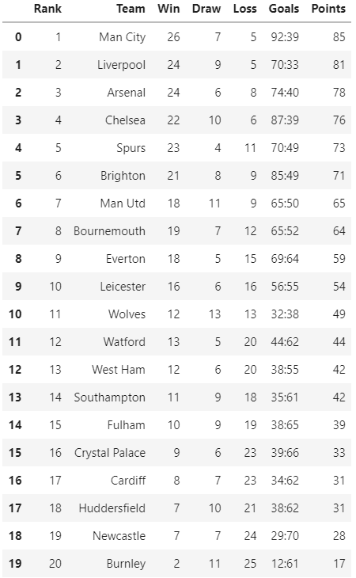
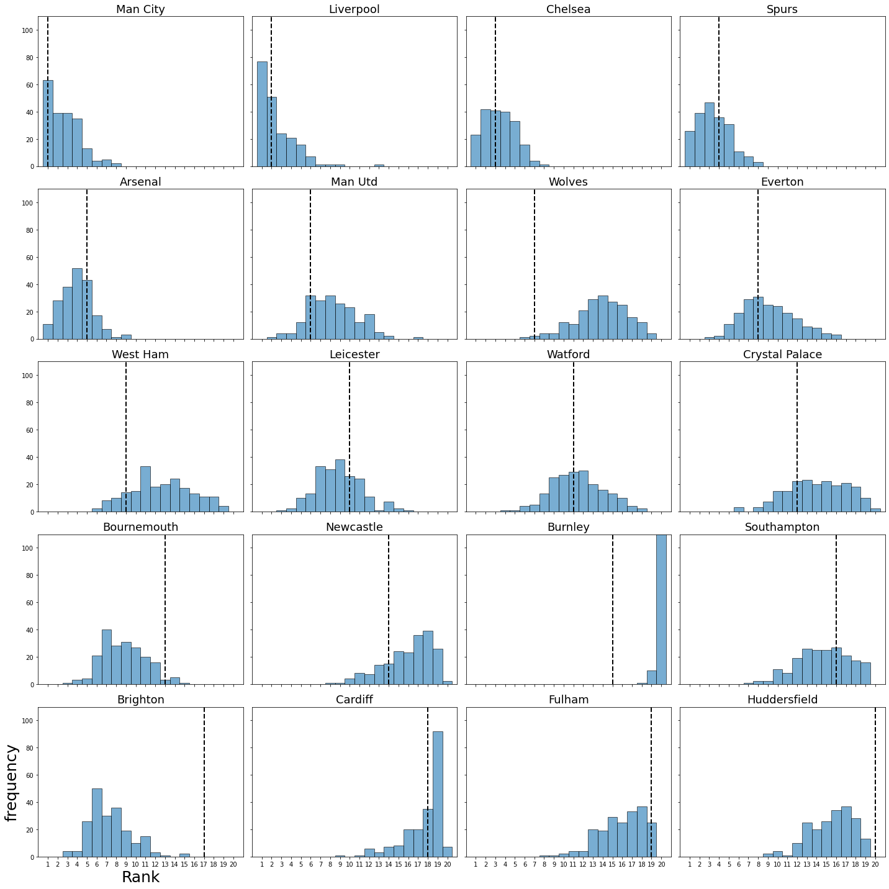

# Football match prediction

Using Poisson regression to predict the football match results.

## Data
 - Matches in England Premier League
 - Trainning period: 10/11 to 17/18 season
 - Testing period: 18/19 season
 
## Model
 - Poisson regression
 - Build a regression model for each team, then predict the match goals for home team and away team separately.
 - It assums that the home goals and away goals are independent. It has been tested in `independence_test.py`.
 
## Result

### model information

| Predict \ Observe | Win  | Draw | Loss |
| :---------------- | :--- | :--- | :--- |
| Win  | 0.2892 | 0.0973 | 0.1000 |
| Draw | 0.1243 | 0.0595 | 0.1027 |
| Loss | 0.0649 | 0.0297 | 0.1324 |

| Indicator |       | value |
| :-------- | :---- | :--- |
| Accuracy  |   -   | 0.4811 |
| Precision | Win   | 0.5944 |
|           | Draw  | 0.2075 |
|           | Loss  | 0.5833 |
| Recall    | Win   | 0.6045 |
|           | Draw  | 0.3188 |
|           | Loss  | 0.3952 |
| F1        | Win   | 0.5994 |
|           | Draw  | 0.2514 |
|           | Loss  | 0.4712 |

### simulate 18/19 season
Given the first five matches, simulate the remainning matches by the Poisson model.  
  
The final table of the simulation:  
  

Simulate the whole season for 200 times, and compare the actually final ranks (black dashed lines) and the simulated ranks (bar).  
  
